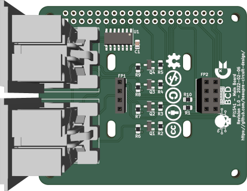
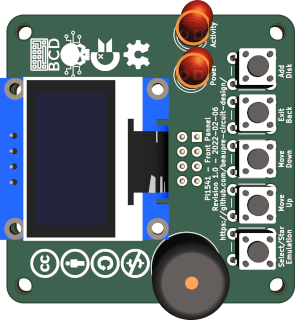
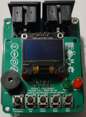
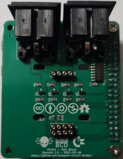

# Pi1541-Hat

# Introduction

An open-source Raspberry-Pi Hat for the [Pi1541 firmware](https://cbm-pi1541.firebaseapp.com/). The Hat is divided into two small PCB, the mainboard with the connectors and support logic, and the control board.  They can be assembled together in one unit, or separatly to fit your choice of enclosure.

# Compatibility

The Hat should be compatible with all 40-pins Raspberry Pi supported by the Pi1541 project. That said, i've only tested it with a Raspberry-Pi Zero 2W.

# Configuration

## Rasperry-Pi Zero/2/3.

Follow the instructions of the official firmware. Once your SD created, change the following lines in the file 'options.txt':

    // Uncomment splitIECLines by uncommenting this line. .
	splitIECLines = 1
	// Enable the LCD Display by uncommenting this line. 
	LCDName = ssd1306_128x64
	// Enable KeyboardBrowseLCDScreen by uncommenting theses lines.
	KeyboardBrowseLCDScreen = 1
	i2cBusMaster = 0
	// Disabling GraphIEC for more stability and compatibility with fastloaders by commenting this line.
	//GraphIEC = 1

## Rasperry-Pi Zero 2W.

Follow the instructions of the [c64-Pi1541-Zero2W-Firmware]([Firmware/](https://github.com/Beaupre-Circuit-Design/c64-Pi1541-Zero2W-Firmware)) Github repository.

# Components and assembly

[Gerbers files](Gerbers/) and SMD assembly files are available for uploading to your prefered manufacturer (I personnally use JLCPCB).  The mainboard use SMT parts (except for the headers) while the control board use through-hole components. Refer to the [Bill of Materials](Pi1541-BOM.xlsx) Excel sheet for a complete list of needed components.

# Licence

This work is licensed under the Creative Commons Attribution-NonCommercial-ShareAlike 4.0 International License. To view a copy of this license, visit http://creativecommons.org/licenses/by-nc-sa/4.0/ or send a letter to Creative Commons, PO Box 1866, Mountain View, CA 94042, USA.

# Revision History

|Revision  |Description                    |
|:--------:|-------------------------------|
|1.0       |Initial prototype              |
